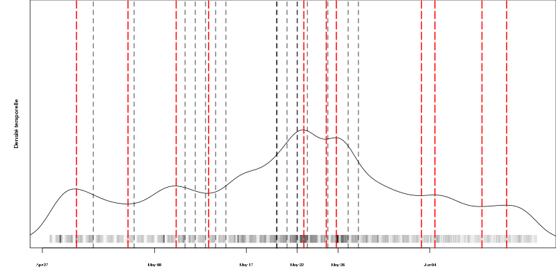
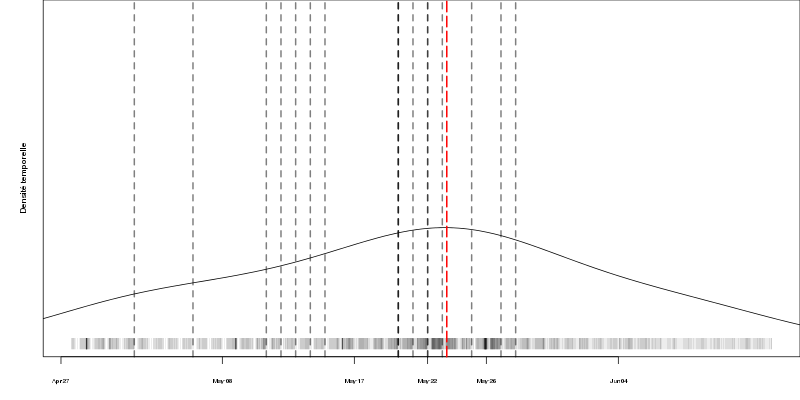
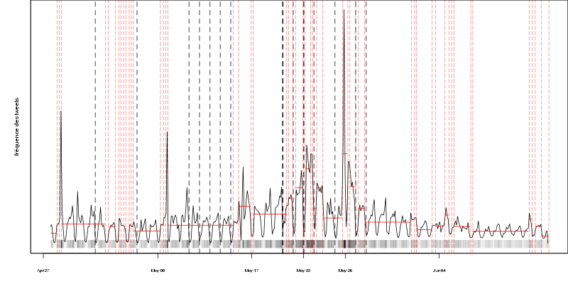
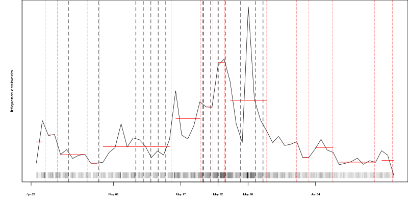
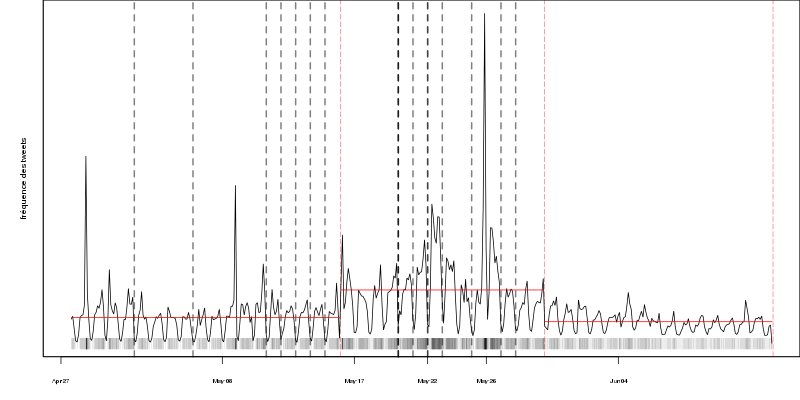
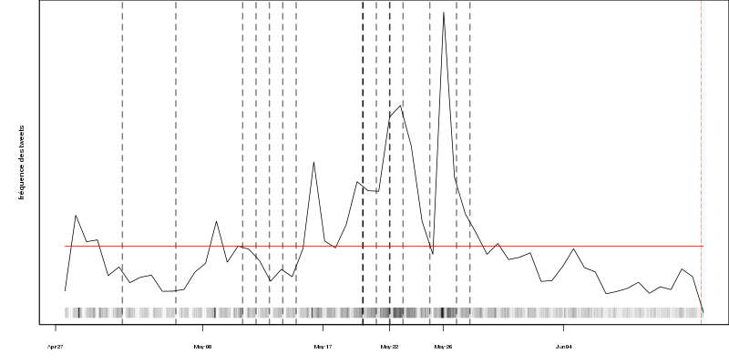

    ##################################################################################
    ##    __ .                         ,      .__ .___.   .___.                      #
    ##   /  `|_  _.._  _  _ ._  _ *._ -+- ___ [__)[__ |     |    .  , __             #
    ##   \__.[ )(_][ )(_](/,[_)(_)|[ ) |      |   [___|___  |     \/ _)              #
    ##                ._|   |                                                        #
    ##    ,                 .           ,                                            # 
    ##   -+-*._ _  _  ___  _| _ ._  __*-+-  .                                        #
    ##    | |[ | )(/,     (_](/,[ )_) | | \_|                                        #
    ##                                    ._|                                        #
    ##                                                                               #
    ##   by Sergey Kirgizov                                                          #
    ##                                                                               #
    ##################################################################################


# Before use


```R
install.packages('changepoint')
install.packages('strucchange')
install.packages('pastecs')
```


# Examples


[Les   timestamps   des  tweets](./data/tweets_timestamp_count)   sont
représenté par la ligne  grisée en bas de la figure.  Plus  il y a des
tweets, plus  la couleur  est foncée.   Les lignes  noires pointillées
sont  [les événements  réels](./data/European Parliamentary  Elections
2014 key  dates uk.txt).  Les lignes  rouges pointillées correspondent
aux  événements  détectés par  les  algorithmes.   Les courbes  noires
montrent  la fréquence  des  tweets (Changepoint-PELT)  ou la  densité
temporelle.   Dans  le  cas  de  Changepoint-PELT  les  lignes  rouges
horizontales indiquent les intervalles stables.


## Overview

### Time-density

Triangular and normal kernels give very **simmilar results**.

                  | Small bandwith                                                      | Large bandwith
----------------- | ------------------------------------------------------------------- | -----------------------------------------------------------------------------
Normal kernel     |                    | 
Triangular kernel |  | 


### Changepoint-PELT

Normal and Gamma distributions give very **different results**.


                     | 6 hours                                                             | 48 hours
-------------------- | ------------------------------------------------------------------- | -----------------------------------------------------------------------------
Normal distribution  |       | 
Gamma  distribution  |        | 


## Time-density


### Normal kernel. Large bandwith

```R
plot.tweets (notevery(uk,2300))
add.real.events ()
add.timedensity (uk, bw=500000)
```


### Normal kernel. Small bandwith

```R
plot.tweets (notevery(uk,2300))
add.real.events ()
add.timedensity (uk, bw=120000)
```


### Triangular kernel. Large bandwith

```R
plot.tweets (notevery(uk,2300))
add.real.events ()
add.timedensity (uk, bw=500000, kernel='triangular')
```


### Triangular kernel. Small bandwith

```R
plot.tweets (notevery(uk,2300))
add.real.events ()
add.timedensity (uk, bw=120000, kernel='triangular')
```


## Changepoint-PELT

### Normal distribution. Time-window's size is 6 hours

```R
plot.tweets (notevery(uk,2300))
add.real.events ()
add.changepoints (uk, window = 6 * hour)
```


### Normal distribution. Time-window's size is 48 hours

```R
plot.tweets (notevery(uk,2300))
add.real.events ()
add.changepoints (uk, window = 48 * hour)
```


### Gamma distribution. Time-window's size is 6 hours

```R
plot.tweets (notevery(uk,2300))
add.real.events ()
add.changepoints (uk, window = 6 * hour, test.stat = "Gamma")
```


### Gamma distribution. Time-window's size is 48 hours

```R
plot.tweets (notevery(uk,2300))
add.real.events ()
add.changepoints (uk, window = 48 * hour, test.stat = "Gamma")
```

